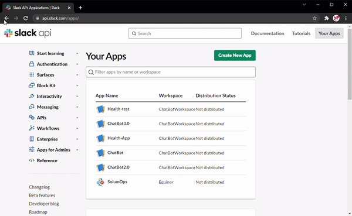
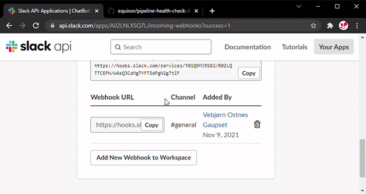

# Pipeline health check to Slack

<p align="center">


</p>

## Description

This action uses a webhook to post Github Actions workflow statuses to a selected Slack Channel.

## How to use

1. Create a workflow in `.github/workflows` directory. File must have suffix `.yml` or `.yaml`.

```yaml
on:
  schedule:
    - cron: "0 1 * * *"
jobs:
  health-check:
    runs-on: ubuntu-latest
    name: Health check
    steps:
      - uses: equinor/pipeline-health@v1
        with:
          uri: ${{ secrets.WEBHOOKURI }}
```

2. [Create a Slack app](https://api.slack.com/apps/), or use existing, and create webhook. Copy the Uri.

<p align="center">

</p>

3. Create secret in the github repository with name `WEBHOOKURI` (Github Environment secret or Repository secret) and paste the value from last step into the `Value` field.

<p align="center">

</p>
